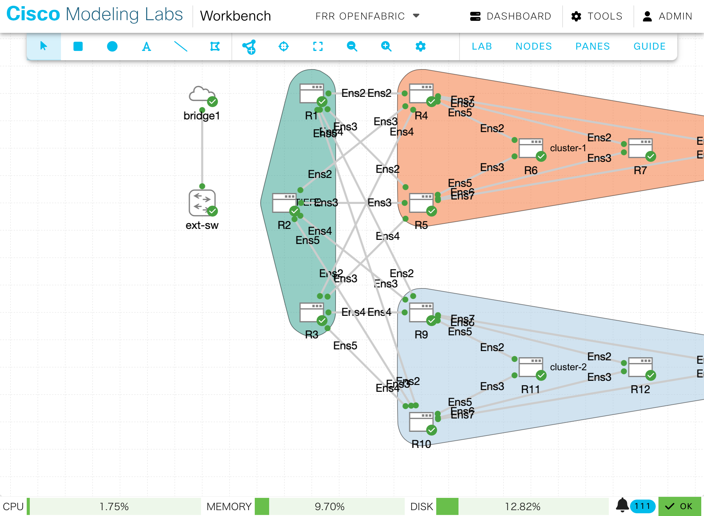

# OpenFabricメモ

draft-white-openfabric-07.txt

概要

- 2025年2月時点でドラフト-07版
- 一般に高密度なメッシュネットワークではリンクステート型プロトコル（ISIS, OSPF）は機能しない
- ISISの機能をしぼってスケーラビリティを向上
- スパインリーフ型トポロジに特化
- レベル2のポイントツーポイント接続のみをサポート
- 隣接関係形成を効率化
- ファブリック内の階層を決定し、それを広告するメカニズムを導入
- 階層の末端（トップオブラックルータ）がTier0(T0)
- 隣接ノードとさらにその先の隣接ノードの情報を利用した高度なフラッディング制御
- トランジットリンクの到達可能性の広告を抑制
- T0（トップオブラック）中間システムをトランジットノードとして使用しないように最適化

<br>

OpenFabricはFRRで実装されていますので、実際に動作を検証してみます。

<br>

## ラボ構成



<br>

## ルータの設定

各ルータの設定はほぼ同じです。

- ループバックにはIPv4とIPv6のアドレスを設定します

- ルータ・ルータ間の物理接続にはIPv6リンクローカルのみを設定します

- ルータの階層によって `fabric-tier` を設定します

<br>

> [!NOTE]
>
> fabric-tierで設定する数字は末端のルータが0で、コア側に行くほど数字が大きくなります

各ルータ（Ubuntu）は初回起動時にcloud-initの中でJinja2のテンプレートから生成したコンフィグを `/etc/frr/frr.conf` に格納しています。

<br>

```jinja
! frr version 10.4-dev
frr defaults traditional
hostname {{ HOSTNAME }}
log syslog informational
service integrated-vtysh-config

!
interface ens{{ i }}
 ip router openfabric 1
 ipv6 address fe80::{{ IPv6_ROUTER_ID }}/64
 ipv6 router openfabric 1
exit

!
interface lo
 ip address 192.168.255.{{ IPv4_ROUTER_ID }}/32
 ip router openfabric 1
 ipv6 address 2001:db8::{{ IPv6_ROUTER_ID }}/128
 ipv6 router openfabric 1
 openfabric passive
exit
!
router openfabric 1
 net 49.0000.0000.00{{ IPv6_ROUTER_ID }}.00
 fabric-tier {{ TIER }}
exit
!
```

<br>

# R1(T2ルータ)のルーティングテーブル

IPv6のルーティングテーブルに関しては特に不思議な点はありません。

R1からみて同じTierであるR2、R3には4本の等コストパスがあります。

```text
R1# show ipv6 route
Codes: K - kernel route, C - connected, L - local, S - static,
       R - RIPng, O - OSPFv3, I - IS-IS, B - BGP, N - NHRP,
       T - Table, v - VNC, V - VNC-Direct, A - Babel, F - PBR,
       f - OpenFabric, t - Table-Direct,
       > - selected route, * - FIB route, q - queued, r - rejected, b - backup
       t - trapped, o - offload failure

IPv6 unicast VRF default:
L * 2001:db8::1/128 is directly connected, lo, weight 1, 00:03:02
C>* 2001:db8::1/128 is directly connected, lo, weight 1, 00:03:02
f>* 2001:db8::2/128 [115/30] via fe80::4, ens2 onlink, weight 1, 00:02:24
  *                          via fe80::5, ens3 onlink, weight 1, 00:02:24
  *                          via fe80::9, ens4 onlink, weight 1, 00:02:24
  *                          via fe80::10, ens5 onlink, weight 1, 00:02:24
f>* 2001:db8::3/128 [115/30] via fe80::4, ens2 onlink, weight 1, 00:02:18
  *                          via fe80::5, ens3 onlink, weight 1, 00:02:18
  *                          via fe80::9, ens4 onlink, weight 1, 00:02:18
  *                          via fe80::10, ens5 onlink, weight 1, 00:02:18
f>* 2001:db8::4/128 [115/20] via fe80::4, ens2 onlink, weight 1, 00:02:32
f>* 2001:db8::5/128 [115/20] via fe80::5, ens3 onlink, weight 1, 00:02:32
f>* 2001:db8::6/128 [115/30] via fe80::4, ens2 onlink, weight 1, 00:02:13
  *                          via fe80::5, ens3 onlink, weight 1, 00:02:13
f>* 2001:db8::7/128 [115/30] via fe80::4, ens2 onlink, weight 1, 00:02:06
  *                          via fe80::5, ens3 onlink, weight 1, 00:02:06
f>* 2001:db8::8/128 [115/30] via fe80::4, ens2 onlink, weight 1, 00:01:55
  *                          via fe80::5, ens3 onlink, weight 1, 00:01:55
f>* 2001:db8::9/128 [115/20] via fe80::9, ens4 onlink, weight 1, 00:02:32
f>* 2001:db8::10/128 [115/20] via fe80::10, ens5 onlink, weight 1, 00:02:32
f>* 2001:db8::11/128 [115/30] via fe80::9, ens4 onlink, weight 1, 00:01:56
  *                           via fe80::10, ens5 onlink, weight 1, 00:01:56
f>* 2001:db8::12/128 [115/30] via fe80::9, ens4 onlink, weight 1, 00:01:43
  *                           via fe80::10, ens5 onlink, weight 1, 00:01:43
f>* 2001:db8::13/128 [115/30] via fe80::9, ens4 onlink, weight 1, 00:01:43
  *                           via fe80::10, ens5 onlink, weight 1, 00:01:43
C * fe80::/64 is directly connected, ens3, weight 1, 00:03:01
C * fe80::/64 is directly connected, ens2, weight 1, 00:03:01
C * fe80::/64 is directly connected, ens9, weight 1, 00:03:01
C * fe80::/64 is directly connected, ens5, weight 1, 00:03:01
C * fe80::/64 is directly connected, ens4, weight 1, 00:03:01
C * fe80::/64 is directly connected, ens8, weight 1, 00:03:02
C * fe80::/64 is directly connected, ens7, weight 1, 00:03:02
C>* fe80::/64 is directly connected, ens6, weight 1, 00:03:02
R1#
```

IPv4のルーティングテーブルはちょっと不思議な感じがします。

```text
R1# show ip route
Codes: K - kernel route, C - connected, L - local, S - static,
       R - RIP, O - OSPF, I - IS-IS, B - BGP, E - EIGRP, N - NHRP,
       T - Table, v - VNC, V - VNC-Direct, A - Babel, F - PBR,
       f - OpenFabric, t - Table-Direct,
       > - selected route, * - FIB route, q - queued, r - rejected, b - backup
       t - trapped, o - offload failure

IPv4 unicast VRF default:
L * 192.168.255.1/32 is directly connected, lo, weight 1, 00:01:09
C>* 192.168.255.1/32 is directly connected, lo, weight 1, 00:01:09
f>* 192.168.255.2/32 [115/30] via 192.168.255.4, ens2 onlink, weight 1, 00:00:27
  *                           via 192.168.255.5, ens3 onlink, weight 1, 00:00:27
  *                           via 192.168.255.9, ens4 onlink, weight 1, 00:00:27
  *                           via 192.168.255.10, ens5 onlink, weight 1, 00:00:27
f>* 192.168.255.3/32 [115/30] via 192.168.255.4, ens2 onlink, weight 1, 00:00:21
  *                           via 192.168.255.5, ens3 onlink, weight 1, 00:00:21
  *                           via 192.168.255.9, ens4 onlink, weight 1, 00:00:21
  *                           via 192.168.255.10, ens5 onlink, weight 1, 00:00:21
f>* 192.168.255.4/32 [115/20] via 192.168.255.4, ens2 onlink, weight 1, 00:00:38
f>* 192.168.255.5/32 [115/20] via 192.168.255.5, ens3 onlink, weight 1, 00:00:38
f>* 192.168.255.6/32 [115/30] via 192.168.255.4, ens2 onlink, weight 1, 00:00:20
  *                           via 192.168.255.5, ens3 onlink, weight 1, 00:00:20
f>* 192.168.255.7/32 [115/30] via 192.168.255.4, ens2 onlink, weight 1, 00:00:14
  *                           via 192.168.255.5, ens3 onlink, weight 1, 00:00:14
f>* 192.168.255.8/32 [115/30] via 192.168.255.4, ens2 onlink, weight 1, 00:00:09
  *                           via 192.168.255.5, ens3 onlink, weight 1, 00:00:09
f>* 192.168.255.9/32 [115/20] via 192.168.255.9, ens4 onlink, weight 1, 00:00:38
f>* 192.168.255.10/32 [115/20] via 192.168.255.10, ens5 onlink, weight 1, 00:00:38
f>* 192.168.255.11/32 [115/30] via 192.168.255.9, ens4 onlink, weight 1, 00:00:04
  *                            via 192.168.255.10, ens5 onlink, weight 1, 00:00:04
R1#
```

**ネクストホップのアドレスが全てルータのループバックアドレス** になっています。

IPv4のアドレスを割り当ててるのはループバックだけなので、それはよいのですが、
**そのループバックアドレスにたどり着くためのネクストホップが同じアドレス**になっている点は違和感を感じます。

たとえばこれ。

`f>* 192.168.255.4/32 [115/20] via 192.168.255.4, ens2 onlink, weight 1, 00:00:38`

192.168.255.4/32に行くためには、同じアドレス192.168.255.4がネクストホップ、となっています。

<br><br>

# R4(T1ルータ)のルーティングテーブル

R4はR5と共にクラスタにおけるスパインを形成しています。

R4からみてR5にたどり着く経路に注目すると、等コストパスが3本登録されていて、中継先はいずれも上位のルータ(R1, R2, R3)になっています。
OpenFabricではT0ルータ（末端のルータ）を経由して通信しないような仕組みが導入されているためです。

インタフェースにコスト（メトリック）を設定しなくても、こういう動作になるのはよいことだと思います。

```text
R4# show ipv6 route
Codes: K - kernel route, C - connected, L - local, S - static,
       R - RIPng, O - OSPFv3, I - IS-IS, B - BGP, N - NHRP,
       T - Table, v - VNC, V - VNC-Direct, A - Babel, F - PBR,
       f - OpenFabric, t - Table-Direct,
       > - selected route, * - FIB route, q - queued, r - rejected, b - backup
       t - trapped, o - offload failure

IPv6 unicast VRF default:
f>* 2001:db8::1/128 [115/20] via fe80::1, ens2 onlink, weight 1, 00:03:43
f>* 2001:db8::2/128 [115/20] via fe80::2, ens3 onlink, weight 1, 00:03:36
f>* 2001:db8::3/128 [115/20] via fe80::3, ens4 onlink, weight 1, 00:03:31
L * 2001:db8::4/128 is directly connected, lo, weight 1, 00:04:36
C>* 2001:db8::4/128 is directly connected, lo, weight 1, 00:04:36
f>* 2001:db8::5/128 [115/30] via fe80::1, ens2 onlink, weight 1, 00:03:31
  *                          via fe80::2, ens3 onlink, weight 1, 00:03:31
  *                          via fe80::3, ens4 onlink, weight 1, 00:03:31
f>* 2001:db8::6/128 [115/20] via fe80::6, ens5 onlink, weight 1, 00:03:24
f>* 2001:db8::7/128 [115/20] via fe80::7, ens6 onlink, weight 1, 00:03:19
f>* 2001:db8::8/128 [115/20] via fe80::8, ens7 onlink, weight 1, 00:03:05
f>* 2001:db8::9/128 [115/30] via fe80::1, ens2 onlink, weight 1, 00:03:31
  *                          via fe80::2, ens3 onlink, weight 1, 00:03:31
  *                          via fe80::3, ens4 onlink, weight 1, 00:03:31
f>* 2001:db8::10/128 [115/30] via fe80::1, ens2 onlink, weight 1, 00:03:31
  *                           via fe80::2, ens3 onlink, weight 1, 00:03:31
  *                           via fe80::3, ens4 onlink, weight 1, 00:03:31
f>* 2001:db8::11/128 [115/40] via fe80::1, ens2 onlink, weight 1, 00:03:07
  *                           via fe80::2, ens3 onlink, weight 1, 00:03:07
  *                           via fe80::3, ens4 onlink, weight 1, 00:03:07
f>* 2001:db8::12/128 [115/40] via fe80::1, ens2 onlink, weight 1, 00:03:01
  *                           via fe80::2, ens3 onlink, weight 1, 00:03:01
  *                           via fe80::3, ens4 onlink, weight 1, 00:03:01
f>* 2001:db8::13/128 [115/40] via fe80::1, ens2 onlink, weight 1, 00:02:56
  *                           via fe80::2, ens3 onlink, weight 1, 00:02:56
  *                           via fe80::3, ens4 onlink, weight 1, 00:02:56
C * fe80::/64 is directly connected, ens3, weight 1, 00:04:35
C * fe80::/64 is directly connected, ens2, weight 1, 00:04:35
C * fe80::/64 is directly connected, ens9, weight 1, 00:04:35
C * fe80::/64 is directly connected, ens5, weight 1, 00:04:35
C * fe80::/64 is directly connected, ens4, weight 1, 00:04:35
C * fe80::/64 is directly connected, ens8, weight 1, 00:04:35
C * fe80::/64 is directly connected, ens7, weight 1, 00:04:36
C>* fe80::/64 is directly connected, ens6, weight 1, 00:04:36
R4#
```

<br>

```text
R4# show ip route
Codes: K - kernel route, C - connected, L - local, S - static,
       R - RIP, O - OSPF, I - IS-IS, B - BGP, E - EIGRP, N - NHRP,
       T - Table, v - VNC, V - VNC-Direct, A - Babel, F - PBR,
       f - OpenFabric, t - Table-Direct,
       > - selected route, * - FIB route, q - queued, r - rejected, b - backup
       t - trapped, o - offload failure

IPv4 unicast VRF default:
f>* 192.168.255.1/32 [115/20] via 192.168.255.1, ens2 onlink, weight 1, 00:02:51
f>* 192.168.255.2/32 [115/20] via 192.168.255.2, ens3 onlink, weight 1, 00:02:46
f>* 192.168.255.3/32 [115/20] via 192.168.255.3, ens4 onlink, weight 1, 00:02:41
L * 192.168.255.4/32 is directly connected, lo, weight 1, 00:03:46
C>* 192.168.255.4/32 is directly connected, lo, weight 1, 00:03:46
f>* 192.168.255.5/32 [115/30] via 192.168.255.1, ens2 onlink, weight 1, 00:02:41
  *                           via 192.168.255.2, ens3 onlink, weight 1, 00:02:41
  *                           via 192.168.255.3, ens4 onlink, weight 1, 00:02:41
f>* 192.168.255.6/32 [115/20] via 192.168.255.6, ens5 onlink, weight 1, 00:02:35
f>* 192.168.255.7/32 [115/20] via 192.168.255.7, ens6 onlink, weight 1, 00:02:29
f>* 192.168.255.8/32 [115/20] via 192.168.255.8, ens7 onlink, weight 1, 00:02:23
f>* 192.168.255.9/32 [115/30] via 192.168.255.1, ens2 onlink, weight 1, 00:02:41
  *                           via 192.168.255.2, ens3 onlink, weight 1, 00:02:41
  *                           via 192.168.255.3, ens4 onlink, weight 1, 00:02:41
f>* 192.168.255.10/32 [115/30] via 192.168.255.1, ens2 onlink, weight 1, 00:02:41
  *                            via 192.168.255.2, ens3 onlink, weight 1, 00:02:41
  *                            via 192.168.255.3, ens4 onlink, weight 1, 00:02:41
f>* 192.168.255.11/32 [115/40] via 192.168.255.1, ens2 onlink, weight 1, 00:02:17
  *                            via 192.168.255.2, ens3 onlink, weight 1, 00:02:17
  *                            via 192.168.255.3, ens4 onlink, weight 1, 00:02:17
f>* 192.168.255.12/32 [115/40] via 192.168.255.1, ens2 onlink, weight 1, 00:02:11
  *                            via 192.168.255.2, ens3 onlink, weight 1, 00:02:11
  *                            via 192.168.255.3, ens4 onlink, weight 1, 00:02:11
f>* 192.168.255.13/32 [115/40] via 192.168.255.1, ens2 onlink, weight 1, 00:02:06
  *                            via 192.168.255.2, ens3 onlink, weight 1, 00:02:06
  *                            via 192.168.255.3, ens4 onlink, weight 1, 00:02:06
R4#
```

<br><br>

# R6(T0ルータ)のルーティングテーブル

```text
R6# show ipv6 route
Codes: K - kernel route, C - connected, L - local, S - static,
       R - RIPng, O - OSPFv3, I - IS-IS, B - BGP, N - NHRP,
       T - Table, v - VNC, V - VNC-Direct, A - Babel, F - PBR,
       f - OpenFabric, t - Table-Direct,
       > - selected route, * - FIB route, q - queued, r - rejected, b - backup
       t - trapped, o - offload failure

IPv6 unicast VRF default:
f>* 2001:db8::1/128 [115/4114] via fe80::4, ens2 onlink, weight 1, 00:03:58
  *                            via fe80::5, ens3 onlink, weight 1, 00:03:58
f>* 2001:db8::2/128 [115/4114] via fe80::4, ens2 onlink, weight 1, 00:03:58
  *                            via fe80::5, ens3 onlink, weight 1, 00:03:58
f>* 2001:db8::3/128 [115/4114] via fe80::4, ens2 onlink, weight 1, 00:03:58
  *                            via fe80::5, ens3 onlink, weight 1, 00:03:58
f>* 2001:db8::4/128 [115/4104] via fe80::4, ens2 onlink, weight 1, 00:03:58
f>* 2001:db8::5/128 [115/4104] via fe80::5, ens3 onlink, weight 1, 00:03:58
L * 2001:db8::6/128 is directly connected, lo, weight 1, 00:04:28
C>* 2001:db8::6/128 is directly connected, lo, weight 1, 00:04:28
f>* 2001:db8::7/128 [115/4114] via fe80::4, ens2 onlink, weight 1, 00:03:53
  *                            via fe80::5, ens3 onlink, weight 1, 00:03:53
f>* 2001:db8::8/128 [115/4114] via fe80::4, ens2 onlink, weight 1, 00:03:40
  *                            via fe80::5, ens3 onlink, weight 1, 00:03:40
f>* 2001:db8::9/128 [115/4124] via fe80::4, ens2 onlink, weight 1, 00:03:58
  *                            via fe80::5, ens3 onlink, weight 1, 00:03:58
f>* 2001:db8::10/128 [115/4124] via fe80::4, ens2 onlink, weight 1, 00:03:58
  *                             via fe80::5, ens3 onlink, weight 1, 00:03:58
f>* 2001:db8::11/128 [115/4134] via fe80::4, ens2 onlink, weight 1, 00:03:41
  *                             via fe80::5, ens3 onlink, weight 1, 00:03:41
f>* 2001:db8::12/128 [115/4134] via fe80::4, ens2 onlink, weight 1, 00:03:34
  *                             via fe80::5, ens3 onlink, weight 1, 00:03:34
f>* 2001:db8::13/128 [115/4134] via fe80::4, ens2 onlink, weight 1, 00:03:30
  *                             via fe80::5, ens3 onlink, weight 1, 00:03:30
C * fe80::/64 is directly connected, ens7, weight 1, 00:04:28
C * fe80::/64 is directly connected, ens4, weight 1, 00:04:28
C * fe80::/64 is directly connected, ens6, weight 1, 00:04:28
C * fe80::/64 is directly connected, ens2, weight 1, 00:04:28
C * fe80::/64 is directly connected, ens8, weight 1, 00:04:28
C * fe80::/64 is directly connected, ens9, weight 1, 00:04:28
C * fe80::/64 is directly connected, ens3, weight 1, 00:04:29
C>* fe80::/64 is directly connected, ens5, weight 1, 00:04:29
R6#
```

<br>

```text
R6# show ip route
Codes: K - kernel route, C - connected, L - local, S - static,
       R - RIP, O - OSPF, I - IS-IS, B - BGP, E - EIGRP, N - NHRP,
       T - Table, v - VNC, V - VNC-Direct, A - Babel, F - PBR,
       f - OpenFabric, t - Table-Direct,
       > - selected route, * - FIB route, q - queued, r - rejected, b - backup
       t - trapped, o - offload failure

IPv4 unicast VRF default:
f>* 192.168.255.1/32 [115/4114] via 192.168.255.4, ens2 onlink, weight 1, 00:04:09
  *                             via 192.168.255.5, ens3 onlink, weight 1, 00:04:09
f>* 192.168.255.2/32 [115/4114] via 192.168.255.4, ens2 onlink, weight 1, 00:04:09
  *                             via 192.168.255.5, ens3 onlink, weight 1, 00:04:09
f>* 192.168.255.3/32 [115/4114] via 192.168.255.4, ens2 onlink, weight 1, 00:04:09
  *                             via 192.168.255.5, ens3 onlink, weight 1, 00:04:09
f>* 192.168.255.4/32 [115/4104] via 192.168.255.4, ens2 onlink, weight 1, 00:04:09
f>* 192.168.255.5/32 [115/4104] via 192.168.255.5, ens3 onlink, weight 1, 00:04:09
L * 192.168.255.6/32 is directly connected, lo, weight 1, 00:04:39
C>* 192.168.255.6/32 is directly connected, lo, weight 1, 00:04:39
f>* 192.168.255.7/32 [115/4114] via 192.168.255.4, ens2 onlink, weight 1, 00:04:02
  *                             via 192.168.255.5, ens3 onlink, weight 1, 00:04:02
f>* 192.168.255.8/32 [115/4114] via 192.168.255.4, ens2 onlink, weight 1, 00:03:56
  *                             via 192.168.255.5, ens3 onlink, weight 1, 00:03:56
f>* 192.168.255.9/32 [115/4124] via 192.168.255.4, ens2 onlink, weight 1, 00:04:09
  *                             via 192.168.255.5, ens3 onlink, weight 1, 00:04:09
f>* 192.168.255.10/32 [115/4124] via 192.168.255.4, ens2 onlink, weight 1, 00:04:09
  *                              via 192.168.255.5, ens3 onlink, weight 1, 00:04:09
f>* 192.168.255.11/32 [115/4134] via 192.168.255.4, ens2 onlink, weight 1, 00:03:50
  *                              via 192.168.255.5, ens3 onlink, weight 1, 00:03:50
f>* 192.168.255.12/32 [115/4134] via 192.168.255.4, ens2 onlink, weight 1, 00:03:44
  *                              via 192.168.255.5, ens3 onlink, weight 1, 00:03:44
f>* 192.168.255.13/32 [115/4134] via 192.168.255.4, ens2 onlink, weight 1, 00:03:39
  *                              via 192.168.255.5, ens3 onlink, weight 1, 00:03:39
R6#
```

<br><br><br>

## 考察

ルータ間の物理インタフェースにはIPv6リンクローカルアドレスしか割り当てていないのに、エンドエンドでIPv4通信が可能になっています。

これはOpenFabricとしての動作なのか、ISISが持つネイティブな動作なのか、ちょっとわからないです。

ISISで同じことをやってみて、同じ動きになるかを確認しようかな・・・

<br>

> [!NOTE]
>
> BGPの場合はRFC8950でIPv4経路のネクストホップをIPv6アドレスにするための仕組みが規定されています。
>
> RFC 8950 - Advertising IPv4 Network Layer Reachability Information (NLRI) with an IPv6 Next Hop

<br>

どうやって隣接ルータに到達するためのMACアドレスを知るのか、疑問が生じますので、実際に通信をキャプチャして確かめてみました。

隣接ルータのループバックアドレスを解決するためのARP Requestが発信されて、隣接ルータはそれに答えていました。

この動作はLinuxなら普通なのかな？
